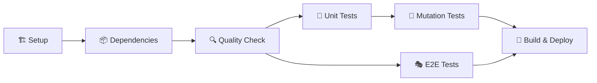

# 🚀 Jenkins Pipeline - PGATS CI Lab

## 📋 Guia de Configuração Completa

### ✅ **Pré-requisitos**

Antes de configurar o Jenkins, certifique-se de ter:
- Jenkins instalado e rodando
- Plugins necessários instalados
- Node.js configurado
- Acesso ao repositório Git

---

## 🔧 **1. Instalação e Configuração do Jenkins**

### **Opção A: Docker (Recomendado)**
```bash
# Executar Jenkins no Docker
docker run -d \
  --name jenkins-pgats \
  -p 8080:8080 \
  -p 50000:50000 \
  -v jenkins_home:/var/jenkins_home \
  jenkins/jenkins:lts

# Obter senha inicial
docker exec jenkins-pgats cat /var/jenkins_home/secrets/initialAdminPassword
```

### **Opção B: Instalação Local**
```bash
# Windows (via Chocolatey)
choco install jenkins

# macOS (via Homebrew)
brew install jenkins

# Linux (Ubuntu/Debian)
curl -fsSL https://pkg.jenkins.io/debian/jenkins.io.key | sudo tee \
  /usr/share/keyrings/jenkins-keyring.asc > /dev/null
echo deb [signed-by=/usr/share/keyrings/jenkins-keyring.asc] \
  https://pkg.jenkins.io/debian binary/ | sudo tee \
  /etc/apt/sources.list.d/jenkins.list > /dev/null
sudo apt update
sudo apt install jenkins
```

---

## 🔌 **2. Plugins Obrigatórios**

Instale os seguintes plugins no Jenkins:

### **Via Interface Web:**
`Manage Jenkins` → `Manage Plugins` → `Available`

**Plugins Essenciais:**
```
✅ Pipeline
✅ Pipeline: Stage View
✅ Git
✅ GitHub
✅ NodeJS
✅ HTML Publisher
✅ Test Results Analyzer
✅ Workspace Cleanup
✅ Build Timeout
✅ Timestamper
```

### **Via CLI:**
```bash
# Lista de plugins para instalar
jenkins-cli.sh install-plugin \
  workflow-aggregator \
  git \
  github \
  nodejs \
  htmlpublisher \
  ws-cleanup \
  build-timeout \
  timestamper
```

---

## 🏗️ **3. Configurar Node.js**

### **Passo 1: Configurar Ferramenta Node.js**
1. `Manage Jenkins` → `Global Tool Configuration`
2. Seção **NodeJS**:
   ```
   Name: NodeJS-18
   Version: NodeJS 18.x
   ✅ Install automatically
   ```

### **Passo 2: Verificar Configuração**
```groovy
// No Jenkinsfile, a linha abaixo usa essa configuração:
def nodeHome = tool name: 'NodeJS-18', type: 'nodejs'
```

---

## 📁 **4. Criar Pipeline no Jenkins**

### **Método 1: Pipeline from SCM (Recomendado)**

1. **New Item** → **Pipeline** → Nome: `PGATS-CI-Pipeline`

2. **Pipeline Configuration:**
   ```
   Definition: Pipeline script from SCM
   SCM: Git
   Repository URL: https://github.com/henriquecervi/pgats-ci-lab.git
   Branch: */main
   Script Path: Jenkinsfile
   ```

3. **Build Triggers:**
   ```
   ✅ Poll SCM: H/5 * * * * (a cada 5 minutos)
   ✅ Build periodically: H 2 * * * (diariamente às 2h)
   ```

### **Método 2: Multibranch Pipeline**

1. **New Item** → **Multibranch Pipeline**

2. **Branch Sources:**
   ```
   Add source: Git
   Project Repository: https://github.com/henriquecervi/pgats-ci-lab.git
   ```

3. **Build Configuration:**
   ```
   Mode: by Jenkinsfile
   Script Path: Jenkinsfile
   ```

---

## 🎯 **5. Estrutura do Pipeline**

### **6 Estágios Principais:**



### **Detalhes dos Estágios:**

1. **🏗️ Setup e Preparação**
   - Checkout do código
   - Configuração Node.js/Yarn
   - Verificação de versões

2. **📦 Instalar Dependências**
   - Cache do Yarn
   - Instalação de dependências
   - Setup navegadores Playwright

3. **🔍 Verificação de Qualidade**
   - Linting em paralelo
   - Verificação de estrutura

4. **🧪 Testes Unitários**
   - Jest com cobertura
   - Publicação de relatórios

5. **🔬 Testes de Mutação**
   - Stryker (só branch main)
   - Timeout 30 minutos

6. **🎭 Testes End-to-End**
   - Playwright multi-browser
   - Screenshots e vídeos

7. **🚀 Build e Deploy**
   - Build da aplicação
   - Arquivamento de artefatos

---

## 📊 **6. Relatórios e Artefatos**

### **Relatórios Publicados:**
- **Coverage Report**: `reports/coverage/lcov-report/index.html`
- **Mutation Report**: `reports/mutation/index.html`
- **Playwright Report**: `playwright-report/index.html`

### **Artefatos Arquivados:**
- **Test Results**: Screenshots, vídeos E2E
- **Build Artifacts**: Aplicação buildada em `dist/`

### **Acesso aos Relatórios:**
```
Jenkins → Build → HTML Reports → Escolher relatório
```

---

## ⚙️ **7. Configurações Avançadas**

### **Variáveis de Ambiente:**
```groovy
environment {
    NODE_VERSION = '18'
    YARN_CACHE_FOLDER = "${WORKSPACE}/.yarn-cache"
    RUN_MUTATION = 'true'  // Para forçar testes de mutação
}
```

### **Triggers Personalizados:**
```groovy
triggers {
    // Verificar mudanças a cada 5 minutos
    scm('H/5 * * * *')
    
    // Execução diária às 2h
    cron('H 2 * * *')
    
    // Webhook do GitHub (requer configuração)
    githubPush()
}
```

### **Configurações de Timeout:**
```groovy
options {
    timeout(time: 30, unit: 'MINUTES')
    buildDiscarder(logRotator(numToKeepStr: '10'))
    skipStagesAfterUnstable()
}
```

---

## 🚨 **8. Troubleshooting**

### **Problemas Comuns:**

**❌ "NodeJS-18 not found"**
```bash
Solução: Configure NodeJS em Global Tool Configuration
```

**❌ "yarn: command not found"**
```bash
Solução: Adicione 'npm install -g yarn' no pipeline
```

**❌ "Permission denied (Docker)"**
```bash
# Adicionar usuário ao grupo docker
sudo usermod -aG docker jenkins
sudo systemctl restart jenkins
```

**❌ "Playwright browsers not found"**
```bash
Solução: 'yarn playwright install --with-deps'
```

### **Logs Úteis:**
```bash
# Verificar logs Jenkins
sudo journalctl -u jenkins

# Logs do workspace
ls -la /var/jenkins_home/workspace/PGATS-CI-Pipeline/
```

---

## 🎓 **9. Configurações para Aprendizado**

### **Pipeline Simplificado (Desenvolvimento):**
```groovy
// Desabilitar alguns estágios
stage('Mutation Tests') {
    when {
        environment name: 'RUN_MUTATION', value: 'true'
    }
    // ...
}
```

### **Notificações por Email:**
```groovy
post {
    failure {
        emailext (
            subject: "Pipeline Failed: ${env.JOB_NAME} - ${env.BUILD_NUMBER}",
            body: "Build failed. Check: ${env.BUILD_URL}",
            to: "your-email@domain.com"
        )
    }
}
```

---

## 📈 **10. Monitoramento e Métricas**

### **Dashboard Recomendado:**
- **Build History**: Taxa de sucesso
- **Test Trends**: Evolução dos testes
- **Coverage Trends**: Cobertura ao longo do tempo

### **Alertas Importantes:**
- 🚨 Build falhando > 2x seguidas
- 🚨 Tempo de execução > 30min
- 🚨 Cobertura < 90%

---

## ✅ **11. Checklist de Configuração**

### **Antes de Executar:**
- [ ] Jenkins instalado e configurado
- [ ] Plugins obrigatórios instalados
- [ ] NodeJS configurado (NodeJS-18)
- [ ] Pipeline criado apontando para Jenkinsfile
- [ ] Repositório acessível

### **Primeira Execução:**
- [ ] Pipeline executou com sucesso
- [ ] Todos os estágios passaram
- [ ] Relatórios publicados
- [ ] Artefatos arquivados

### **Configuração Completa:**
- [ ] Triggers automáticos funcionando
- [ ] Notificações configuradas
- [ ] Dashboards criados
- [ ] Backup configurado

---

## 🎯 **Resultado Final**

Após seguir este guia, você terá:
- ✅ **Pipeline completo** no Jenkins
- ✅ **Execução automática** a cada commit
- ✅ **Relatórios detalhados** de qualidade
- ✅ **Monitoramento contínuo** dos testes
- ✅ **Arquivamento** de artefatos

**Perfeito para demonstrar CI/CD no PGATS!** 💜⚡️

---

## 🔗 Links Úteis

- **Jenkins Documentation**: https://www.jenkins.io/doc/
- **Pipeline Syntax**: https://www.jenkins.io/doc/book/pipeline/syntax/
- **Plugin Index**: https://plugins.jenkins.io/